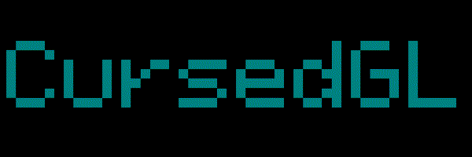
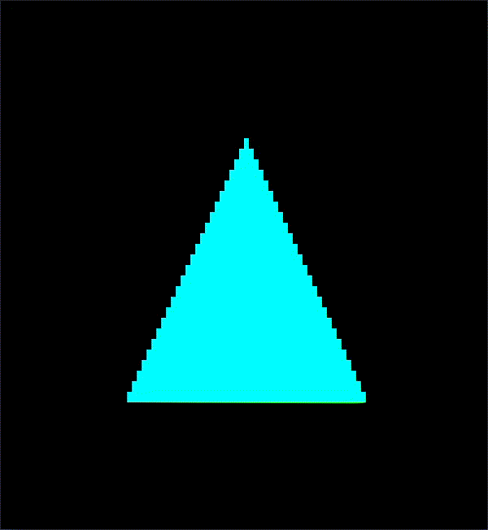

*Made with C99* <br/>

<a href="#"><a/>
<a href="#"></a>
<a href="#"></a>
<a href="#"></a>
<a href="#"></a>

# Description:

**CursedGL is an notcurses-based software rasterizer that renders directly to the terminal**

# Usage:

```c

#include <cursedgl.h>

// Quit rendering if Q is pressed
static bool processInput()
{
    struct ncinput input;
    notcurses_get_nblock(txGetContext(), &input);

    if (input.id == 'q')
        return true;
    return false;
}

// Spinning triangle
int main(void)
{
    // Initialize CursedGL
    if (!txInit()) {
        fprintf(stderr, "ERROR: couldn't initialize CursedGL\n");
        return -1;
    }

    // Set the color the framebuffer will be cleared with
    txClearColor3f(0.2f, 0.3f, 0.3f);

    // TRex uses right-handed coordinate-system
    txTranslate3f(0.0f, 0.0f, -2.0f);
    
    // Render loop
    while (!processInput()) {
    
        // Clear the framebuffer
        txClear(TX_COLOR_BIT | TX_DEPTH_BIT);

        // Occupy the whole terminal area
        txViewportMax();

        // Use perspective projection
        txPerspective(TX_PI / 2.0f,
                      txGetFramebufferAspectRatio(),
                      0.1f,
                      100.0f);

        // Specify the vertex data for our triangle
        TXvec4 v0[] = { { -1.0f, -1.0f, 0.0f, 1.0f },
                      {    1.0f,  0.0f, 0.0f, 1.0f } };
        TXvec4 v1[] = { {  1.0f, -1.0f, 0.0f, 1.0f },
                      {    0.0f,  1.0f, 0.0f, 1.0f } };
        TXvec4 v2[] = { {  0.0f,  1.0f, 0.0f, 1.0f },
                        {  0.0f,  0.0f, 1.0f, 1.0f } };
        
        // Rotate the triangle continuously around y-axis
        txRotate4f(0.01f, 0.0f, 1.0f, 0.0f);
        
        // Draw the triangle with one of the predefined
        // vertex-attribute configurations (here we use
        // TX_POSITION_COLOR, for more see enum TXvertexInfo
        // in rasterizer.h)
        txDrawTriangle(v0, v1, v2, TX_POSITION_COLOR);

        // Swap the front and back framebuffers
        txSwapBuffers();
    }
    
    // Free memory used for rendering
    txEnd();
    
    // Success
    return 0;
}

````

# Output:



# Features:

- Supports points, lines, line-loops, line-strips, triangles, triangle-fans, triangle-strips, and quads
- In addition to the above some basic shapes like cubes and planes are provided out-of-the-box
- Face Culling
- Triangle Clipping
- Perspective-Correct Vertex-Attribute Interpolation
- Early Depth Testing
- 3 Shading Modes:
  - Unlit
  - Flat
  - Smooth
- Built-in Math Library
- Right-handed Coordinate System
- Multi-threaded rendering
- 2 Rendering Modes:
  - Block
  - ASCII
- Double-buffering
- API similar to OpenGL's Immediate Mode Interface
- 3 Supported Light Types:
  - Directional
  - Point
  - Spot
- Matrix Stacks

# Known Bugs And Issues:

- No texture support *yet*
- More sophisticated multi-threading system would be better
- Math library needs SIMD implementation
- No stencil buffer
- No blending
- Error-reporting functionality is very primitive and requires improvement
- Code needs testing

# Building:

## Linux
    
Make sure to have GCC, ncurses, and cmake installed.

```
$ git clone https://github.com/saccharineboi/CursedGL.git
$ cd CursedGL
$ mkdir build && cd build
$ cmake ..
$ make
```
    
## Windows 10, 11

Windows 10 and 11 come pre-installed with Linux kernel out-of-the-box.
    
You need to enable WSL2 and install Ubuntu from the Windows Store.
    
[This video will be helpful.](https://youtu.be/_fntjriRe48)
    
After you've got everything working, follow the instructions for the linux users above.
    
Don't forget to update your system before installing the dependencies:

```
$ sudo apt update
$ sudo apt upgrade
```
Also make sure the dependencies are installed:
    
```
$ sudo apt install build-essential cmake libncurses5-dev
```
    
# Learning:
*Check the examples/ folder for code samples*
    
*Check the comments in the source files under src/ folder*
    

# Contact:

Grab my public key [here](https://flowcrypt.com/pub/saccharineboi@gmail.com?show=pubkey) and send me an email.
    
PGP fingerprint: 693E AD50 5142 9D3F 74D9  F415 869B 4A61 D04F AD71

# Similar Projects:
    
 #### - [minirender](https://github.com/aslze/minirender) by *asize* : A simple software rasterizer for 3D meshes
    
# Donations and Tips:

If you wish to, you can donate anonymously to one of the following addresses:

<a href="#" target="_blank" title="Monero"></a>
    
<a href="#" target="_blank" title="Bitcoin"></a>
    
<a href="#" target="_blank" title="Ethereum"></a>
    
<a href="#" target="_blank" title="Dogecoin"></a>
    
<br>
    
**Thanks for the support!**

# License:

CursedGL is free software: you can redistribute it and/or modify it under the terms of the GNU General Public License as published by the Free Software Foundation, either version 3 of the License, or (at your option) any later version.

CursedGL is distributed in the hope that it will be useful, but WITHOUT ANY WARRANTY; without even the implied warranty of MERCHANTABILITY or FITNESS FOR A PARTICULAR PURPOSE. See the GNU General Public License for more details.

You should have received a copy of the GNU General Public License along with CursedGL. If not, see <https://www.gnu.org/licenses/>.
