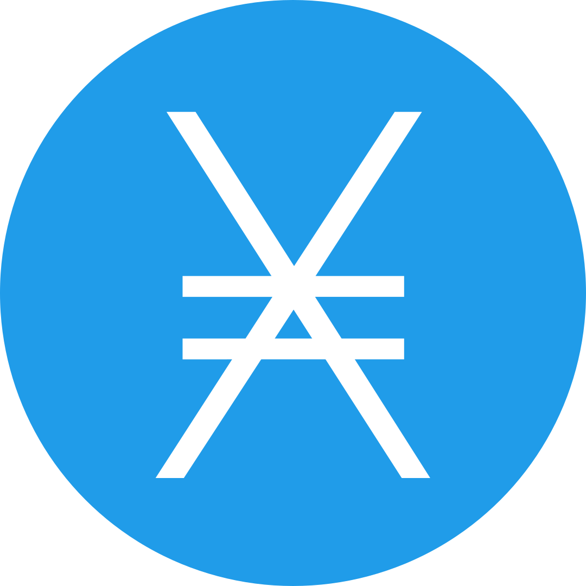

*Made with C99* <br/>

<a href="#"><a/>
<a href="#"></a>
<a href="#"></a>
<a href="#"></a>
<a href="#"></a>

# Description:

**TRex is an ncurses-based software rasterizer that renders directly to the terminal**

# Usage:

```c

#include <trex.h>

// Calling wgetch (as in processInput)
// implicitly invokes refresh(). Hence
// it's important to handle input on a
// different window than the one TRex
// is rendering onto. See ncurses
// documentation for more info
static WINDOW* createInputWindow()
{
    WINDOW* input_win = newwin(0, 0, 0, 0);
    raw();
    noecho();
    nodelay(input_win, true);
    keypad(input_win, true);
    return input_win;
}

// Quit rendering if Q is pressed
static bool processInput(WINDOW* win)
{
    if (wgetch(win) == 'q')
        return true;
    return false;
}

// Spinning triangle
int main(void)
{
    // Initialize TRex
    if (!txInit(TX_BLOCK_MODE)) {
        fprintf(stderr, "ERROR: couldn't initialize TRex\n");
        return -1;
    }

    // Create a separate window for input handling
    WINDOW* input_win = createInputWindow();

    // Set the color the framebuffer will be cleared with
    txClearColor3f(0.0f, 0.0f, 0.0f);
    
    // Occupy the whole terminal area
    txViewportMax();

    // Use perspective projection
    txPerspective(TX_PI / 2.0f,
                  txGetFramebufferAspectRatio(),
                  0.1f,
                  100.0f);

    // TRex uses right-handed coordinate-system
    txTranslate3f(0.0f, 0.0f, -2.0f);
    
    // Render loop
    while (!processInput(input_win)) {
    
        // Clear the framebuffer
        txClear(TX_COLOR_BIT | TX_DEPTH_BIT);

        // Specify the vertex data for our triangle
        TXvec4 pos0 = { -1.0f, -1.0f, 0.0f, 1.0f };
        TXvec4 pos1 = {  1.0f, -1.0f, 0.0f, 1.0f };
        TXvec4 pos2 = {  0.0f,  1.0f, 0.0f, 1.0f };

        // Specify the color of the triangle
        txColor3f(0.0f, 1.0f, 1.0f);
        
        // Rotate the triangle continuously around y-axis
        txRotate4f(0.01f, 0.0f, 1.0f, 0.0f);
        
        // Draw the triangle with one of the predefined
        // vertex-attribute configurations (here we use
        // TX_POSITION, for more see enum TXvertexInfo
        // in rasterizer.h)
        txDrawTriangle(&pos0, &pos1, &pos2, TX_POSITION);

        // Swap the front and back framebuffers
        txSwapBuffers();
    }

    // Delete the ncurses window used for input-handling
    delwin(input_win);
    
    // Free memory used for rendering
    txEnd();
    
    // Success
    return 0;
}

````

# Output:


# Features:

- Supports points, lines, line-loops, line-strips, triangles, triangle-fans, triangle-strips, and quads
- In addition to the above some basic shapes like cubes and floors are provided out-of-the-box
- Face Culling
- Triangle Clipping
- Perspective-Correct Vertex-Attribute Interpolation
- Early Depth Testing
- 3 Shading Modes:
  - Unlit
  - Flat
  - Smooth
- Built-in Math Library
- Right-handed Coordinate System
- Multi-threaded rendering
- 2 Rendering Modes:
  - Block
  - ASCII
- Double-buffering
- API similar to OpenGL's Immediate Mode Interface
- 3 Supported Light Types:
  - Directional
  - Point
  - Spot
- Matrix Stacks

# Known Bugs And Issues:

- Viewport cannot be resized
- No texture support *yet*
- More sophisticated multi-threading system would be better
- Math library needs SIMD implementation
- No stencil buffer
- No blending
- Error-reporting functionality is very primitive and requires improvement
- Code needs testing

# Building:

## Linux
    
Make sure to have GCC, ncurses, and cmake installed.

```
$ git clone https://github.com/saccharineboi/TRex.git
$ cd TRex
$ mkdir build && cd build
$ cmake ..
$ make
```
    
## Windows 10, 11

Windows 10 and 11 come pre-installed with Linux kernel out-of-the-box.
    
You need to enable WSL2 and install Ubuntu from the Windows Store.
    
[This video will be helpful.](https://youtu.be/_fntjriRe48)
    
After you've got everything working, follow the instructions for the linux users above.
    
Don't forget to update your system before installing the dependencies:

```
$ sudo apt update
$ sudo apt upgrade
```
    
    
# Learning:
*Check the examples/ folder for code samples*
    
*Check the comments in the source files under src/ folder*
    

# Contact:

Grab my public key [here](https://flowcrypt.com/pub/saccharineboi@gmail.com?show=pubkey) and send me an email.
    
PGP fingerprint: 693E AD50 5142 9D3F 74D9  F415 869B 4A61 D04F AD71

# Donations and Tips:

If you wish to, you can donate anonymously to one of the following addresses:

<a href="#" target="_blank" title="Bitcoin"></a>
<a href="#" target="_blank" title="Bitcoin Cash"></a>
<a href="#" target="_blank" title="Ethereum"></a>
<a href="#" target="_blank" title="Monero"></a>
<a href="#" target="_blank" title="Dogecoin"></a>
<a href="#" target="_blank" title="Nano"></a>
<a href="#" target="_blank" title="Peercoin"></a>
<a href="#" target="_blank" title="ZCash"></a>
    
**Thanks for the support!**


